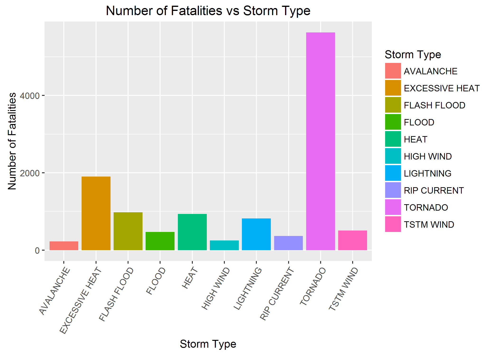
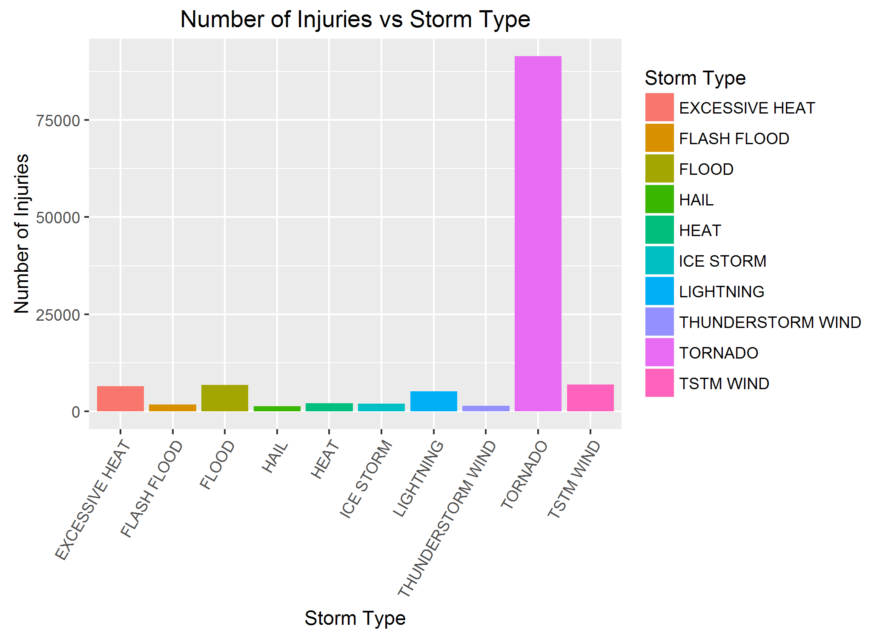
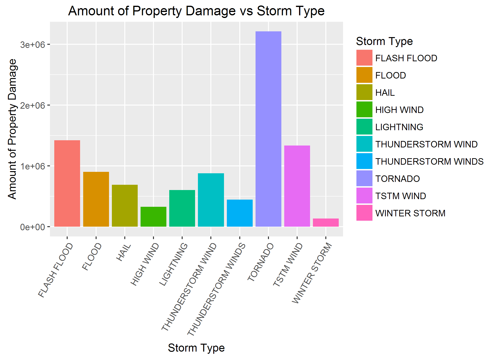

# Storm Types that have Harmful Health and Economic Consequences
Damon Resnick  
January 16, 2017  

### Synopsis  

This document is a completion of an assignment from the last week of the Reproducible Research class on Coursera through Johns Hopkins, the fifth course in the Data Science specialization: "The basic goal of this assignment is to explore the NOAA Storm Database and answer some basic questions about severe weather events. You must use the database to answer the questions below and show the code for your entire analysis. Your analysis can consist of tables, figures, or other summaries. You may use any R package you want to support your analysis."  The events in the database start in the year 1950 and end in November 2011. In the earlier years of the database there are generally fewer events recorded, most likely due to a lack of good records. More recent years should be considered more complete.  

The data analysis addresses the following questions:  

1) Across the United States, which types of events (as indicated in the EVTYPE variable) are most harmful with respect to population health?  
  
2) Across the United States, which types of events have the greatest economic consequences?  

#### Data was taken off the course website but comes from the National Weather Service.  


### Data Processing


```r
# This file is very large and takes about a minute to read into R.
df <- read.csv("./repdataStormDatazip.bz2")
head(df)
```

```
##   STATE__           BGN_DATE BGN_TIME TIME_ZONE COUNTY COUNTYNAME STATE
## 1       1  4/18/1950 0:00:00     0130       CST     97     MOBILE    AL
## 2       1  4/18/1950 0:00:00     0145       CST      3    BALDWIN    AL
## 3       1  2/20/1951 0:00:00     1600       CST     57    FAYETTE    AL
## 4       1   6/8/1951 0:00:00     0900       CST     89    MADISON    AL
## 5       1 11/15/1951 0:00:00     1500       CST     43    CULLMAN    AL
## 6       1 11/15/1951 0:00:00     2000       CST     77 LAUDERDALE    AL
##    EVTYPE BGN_RANGE BGN_AZI BGN_LOCATI END_DATE END_TIME COUNTY_END
## 1 TORNADO         0                                               0
## 2 TORNADO         0                                               0
## 3 TORNADO         0                                               0
## 4 TORNADO         0                                               0
## 5 TORNADO         0                                               0
## 6 TORNADO         0                                               0
##   COUNTYENDN END_RANGE END_AZI END_LOCATI LENGTH WIDTH F MAG FATALITIES
## 1         NA         0                      14.0   100 3   0          0
## 2         NA         0                       2.0   150 2   0          0
## 3         NA         0                       0.1   123 2   0          0
## 4         NA         0                       0.0   100 2   0          0
## 5         NA         0                       0.0   150 2   0          0
## 6         NA         0                       1.5   177 2   0          0
##   INJURIES PROPDMG PROPDMGEXP CROPDMG CROPDMGEXP WFO STATEOFFIC ZONENAMES
## 1       15    25.0          K       0                                    
## 2        0     2.5          K       0                                    
## 3        2    25.0          K       0                                    
## 4        2     2.5          K       0                                    
## 5        2     2.5          K       0                                    
## 6        6     2.5          K       0                                    
##   LATITUDE LONGITUDE LATITUDE_E LONGITUDE_ REMARKS REFNUM
## 1     3040      8812       3051       8806              1
## 2     3042      8755          0          0              2
## 3     3340      8742          0          0              3
## 4     3458      8626          0          0              4
## 5     3412      8642          0          0              5
## 6     3450      8748          0          0              6
```


```r
# check for NAs, they will be TRUEs summary(is.na(df)) There are a few NAs in
# LATITUDE and LATITUDE_E column, and a lot in F column, with none in the other
# columns.
```

<br>   

One question that we would like to answer is which types of events are most harmful with respect to population health?  The different storm types are shown in the EVTYPE column, while there is a fatality and injury column that matches to the storm type.

```r
summary(df$EVTYPE)
```

```
##                     HAIL                TSTM WIND        THUNDERSTORM WIND 
##                   288661                   219940                    82563 
##                  TORNADO              FLASH FLOOD                    FLOOD 
##                    60652                    54277                    25326 
##       THUNDERSTORM WINDS                HIGH WIND                LIGHTNING 
##                    20843                    20212                    15754 
##               HEAVY SNOW               HEAVY RAIN             WINTER STORM 
##                    15708                    11723                    11433 
##           WINTER WEATHER             FUNNEL CLOUD         MARINE TSTM WIND 
##                     7026                     6839                     6175 
## MARINE THUNDERSTORM WIND               WATERSPOUT              STRONG WIND 
##                     5812                     3796                     3566 
##     URBAN/SML STREAM FLD                 WILDFIRE                 BLIZZARD 
##                     3392                     2761                     2719 
##                  DROUGHT                ICE STORM           EXCESSIVE HEAT 
##                     2488                     2006                     1678 
##               HIGH WINDS         WILD/FOREST FIRE             FROST/FREEZE 
##                     1533                     1457                     1342 
##                DENSE FOG       WINTER WEATHER/MIX           TSTM WIND/HAIL 
##                     1293                     1104                     1028 
##  EXTREME COLD/WIND CHILL                     HEAT                HIGH SURF 
##                     1002                      767                      725 
##           TROPICAL STORM           FLASH FLOODING             EXTREME COLD 
##                      690                      682                      655 
##            COASTAL FLOOD         LAKE-EFFECT SNOW        FLOOD/FLASH FLOOD 
##                      650                      636                      624 
##                LANDSLIDE                     SNOW          COLD/WIND CHILL 
##                      600                      587                      539 
##                      FOG              RIP CURRENT              MARINE HAIL 
##                      538                      470                      442 
##               DUST STORM                AVALANCHE                     WIND 
##                      427                      386                      340 
##             RIP CURRENTS              STORM SURGE            FREEZING RAIN 
##                      304                      261                      250 
##              URBAN FLOOD     HEAVY SURF/HIGH SURF        EXTREME WINDCHILL 
##                      249                      228                      204 
##             STRONG WINDS           DRY MICROBURST    ASTRONOMICAL LOW TIDE 
##                      196                      186                      174 
##                HURRICANE              RIVER FLOOD               LIGHT SNOW 
##                      174                      173                      154 
##         STORM SURGE/TIDE            RECORD WARMTH         COASTAL FLOODING 
##                      148                      146                      143 
##               DUST DEVIL         MARINE HIGH WIND        UNSEASONABLY WARM 
##                      141                      135                      126 
##                 FLOODING   ASTRONOMICAL HIGH TIDE        MODERATE SNOWFALL 
##                      120                      103                      101 
##           URBAN FLOODING               WINTRY MIX        HURRICANE/TYPHOON 
##                       98                       90                       88 
##            FUNNEL CLOUDS               HEAVY SURF              RECORD HEAT 
##                       87                       84                       81 
##                   FREEZE                HEAT WAVE                     COLD 
##                       74                       74                       72 
##              RECORD COLD                      ICE  THUNDERSTORM WINDS HAIL 
##                       64                       61                       61 
##      TROPICAL DEPRESSION                    SLEET         UNSEASONABLY DRY 
##                       60                       59                       56 
##                    FROST              GUSTY WINDS      THUNDERSTORM WINDSS 
##                       53                       53                       51 
##       MARINE STRONG WIND                    OTHER               SMALL HAIL 
##                       48                       48                       47 
##                   FUNNEL             FREEZING FOG             THUNDERSTORM 
##                       46                       45                       45 
##       Temperature record          TSTM WIND (G45)         Coastal Flooding 
##                       43                       39                       38 
##              WATERSPOUTS    MONTHLY PRECIPITATION                    WINDS 
##                       37                       36                       36 
##                  (Other) 
##                     2940
```

```r
# It looks like hail, high winds, and thunderstorms are common but right below
# these are tornados, flash flood, and etc.  These are probably contribute to the
# most fatalities.  Lets check this out.
```

<br>  

Let's look at fatalities first.

```r
summary(df$FATALITIES)
```

```
##     Min.  1st Qu.   Median     Mean  3rd Qu.     Max. 
##   0.0000   0.0000   0.0000   0.0168   0.0000 583.0000
```

```r
# Sum the number of fatalities by evtype
fataltype <- aggregate(FATALITIES ~ EVTYPE, data = df, sum)
# Order fataltype in descending order by number of fatalities
ftord <- fataltype[order(fataltype[, 2], decreasing = TRUE), ]
# Look at the first 10 most fatal types of weather events
ftord10 <- ftord[1:10, ]
ftord10
```

```
##             EVTYPE FATALITIES
## 834        TORNADO       5633
## 130 EXCESSIVE HEAT       1903
## 153    FLASH FLOOD        978
## 275           HEAT        937
## 464      LIGHTNING        816
## 856      TSTM WIND        504
## 170          FLOOD        470
## 585    RIP CURRENT        368
## 359      HIGH WIND        248
## 19       AVALANCHE        224
```
<br>  

So it looks like tornadoes have the most adverse effect on people in the US by resulting in 5633 fatalities from 1995 to 2011.  


```r
library(ggplot2)
p1 <- ggplot(ftord10, aes(y = FATALITIES, x = EVTYPE, fill = EVTYPE)) + geom_bar(stat = "identity") + 
    labs(title = "Number of Fatalities vs Storm Type", x = "Storm Type", y = "Number of Fatalities", 
        fill = "Storm Type") + theme(axis.text.x = element_text(angle = 60, hjust = 1))
```
<br>  

Now lets look at injuries.

```r
summary(df$INJURIES)
```

```
##      Min.   1st Qu.    Median      Mean   3rd Qu.      Max. 
##    0.0000    0.0000    0.0000    0.1557    0.0000 1700.0000
```

```r
# Sum the number of injuries by evtype
injurytype <- aggregate(INJURIES ~ EVTYPE, data = df, sum)
# Order injurytype in descending order by number of injuries
injord <- injurytype[order(injurytype[, 2], decreasing = TRUE), ]
# Look at the first 10 most fatal types of weather events
injord10 <- injord[1:10, ]
injord10
```

```
##                EVTYPE INJURIES
## 834           TORNADO    91346
## 856         TSTM WIND     6957
## 170             FLOOD     6789
## 130    EXCESSIVE HEAT     6525
## 464         LIGHTNING     5230
## 275              HEAT     2100
## 427         ICE STORM     1975
## 153       FLASH FLOOD     1777
## 760 THUNDERSTORM WIND     1488
## 244              HAIL     1361
```


```r
p2 <- ggplot(injord10, aes(y = INJURIES, x = EVTYPE, fill = EVTYPE)) + geom_bar(stat = "identity") + 
    labs(title = "Number of Injuries vs Storm Type", x = "Storm Type", y = "Number of Injuries", 
        fill = "Storm Type") + theme(axis.text.x = element_text(angle = 60, hjust = 1))
```

<br>  

Another question we would like to answer are what storm types cause the most economic damage.  


```r
summary(df$PROPDMG)
```

```
##    Min. 1st Qu.  Median    Mean 3rd Qu.    Max. 
##    0.00    0.00    0.00   12.06    0.50 5000.00
```

```r
# Sum the number of injuries by evtype
propdmgtype <- aggregate(PROPDMG ~ EVTYPE, data = df, sum)
# Order injurytype in descending order by number of injuries
propord <- propdmgtype[order(propdmgtype[, 2], decreasing = TRUE), ]
# Look at the first 10 most fatal types of weather events
propord10 <- propord[1:10, ]
propord10
```

```
##                 EVTYPE   PROPDMG
## 834            TORNADO 3212258.2
## 153        FLASH FLOOD 1420124.6
## 856          TSTM WIND 1335965.6
## 170              FLOOD  899938.5
## 760  THUNDERSTORM WIND  876844.2
## 244               HAIL  688693.4
## 464          LIGHTNING  603351.8
## 786 THUNDERSTORM WINDS  446293.2
## 359          HIGH WIND  324731.6
## 972       WINTER STORM  132720.6
```
It looks like tornadoes once again are a major problem.

<br>  

### Results

Plotted together you can see Fatalities and Injuries are mostly caused by the same thing, but tornadoes are the clear winner in both categories. 

```r
p1
```



```r
p2
```



<br>  


```r
p3 <- ggplot(propord10, aes(y = PROPDMG, x = EVTYPE, fill = EVTYPE)) + geom_bar(stat = "identity") + 
    labs(title = "Amount of Property Damage vs Storm Type", x = "Storm Type", y = "Amount of Property Damage", 
        fill = "Storm Type") + theme(axis.text.x = element_text(angle = 60, hjust = 1))
p3
```



We are also not too surprised to see tornadoes cause the most damage, and events like floods and extreme wind storms cause about half as much damage.

<br>  

### Conclusion

Tornadoes are clearly the worst type of weather event in the United States.  Their frequency and destruction capability insure that they are deadly, cause many injuries, and have a large negative economic impact.

